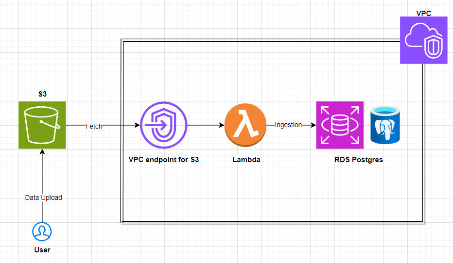

# ELT pipeline using AWS
This is a ELT pipeline build using AWS services such as S3, Lamda, RDS, Cloudwatch and VPC.

Prerequisites:
    Pgadmin should be installed.

## Pipeline explaination:
1. Data is uploaded as CSV files to S3: 'hospital_database'.
2. Upload event triggers lambda for processing: 'data_ingestion_caspar'
3. Within the lambda function, 'AWS SDK for Pandas' layer which is provided by AWS is used for 
reading the data as dataframe and ingesting the data to RDS Postgres. For database operations, 
AWS datawrangler and pg8000 modules, which are available within Pandas SDK is used.
4. Data read from csv is cleaned to remove unnecessary columns like: "Unnamed" in patients.csv and 
saved as dataframe. This dataframe is then ingested into teh respective tables in RDS. CSV 
filename is fetched as table name in RDS.
5. Since RDS is configured to be within a VPC, lambda function is configured within the same VPC. 
Hence, an endpoint for the same VPC is created to access S3 for file download by lambda.
6. The database is then access through the software: pgadmin, where further data manipulation and
final query for the result is performed. All these query scripts are provided in query.sql file.
7. Cloudwatch is used for logging.

## Video Proof
The VPC endpoint to access S3 files and download using lambda which is configured within the VPC was charging money, I have deleted the resources (VPC and RDS) created on AWS. I have attached a video of the working.

Please let me know if I need  to reproduce the results. Happy to do so.
Video: https://github.com/venkateshhs/caspar_technical_challenge/tree/main/AWS/video_proof

    
    
