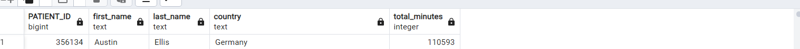

# Caspar Technnical Challenge
        This repository contains 3 sub folders
                1. AWS : ELT pipeline built using AWS.
                2. docker_pipeline : ELT pipline built using docker.
                3. extract_load : A nomal ELT pipline built by using pgadmin, sql and python.

Each of these sub folders contains separate README.md files explaining each approach.

General assumptions for all the approach.
1. I have assumed data to be correct, no data correction, cleaning or validation is done.
2. We have assumed that there will be three csv files as input and three tables are created in database.
3. In all the three approaches, postgres db is used.
4. To execute the pipeline, docker, git, python and pgadmin should be installed in host machine.
5. Only reading and ingestion od data into db is done using python.

Data_transformation assumptions:
1. A new column called "generated_minutes" is added on all the three approaches to calculate minutes using steps.
2. Column STEPS in table(or csv) is renamed as footsteps in db to reduce ambiguity.
3. All the data transformation is done using sql.

Answer to the Question:"Find the patient(s) with the most generated minutes" is 

For individual implementation details, Please go to sub folders AWS, docker_pipeline and extract_load
