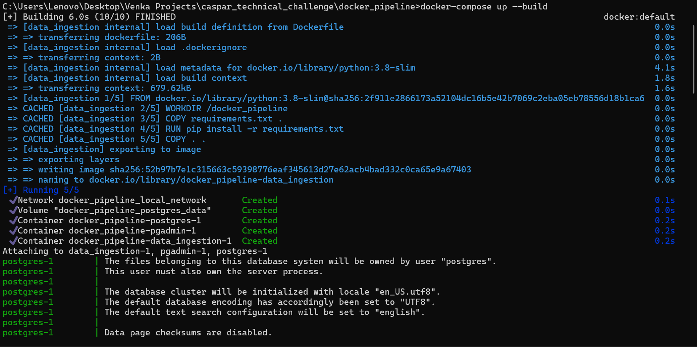
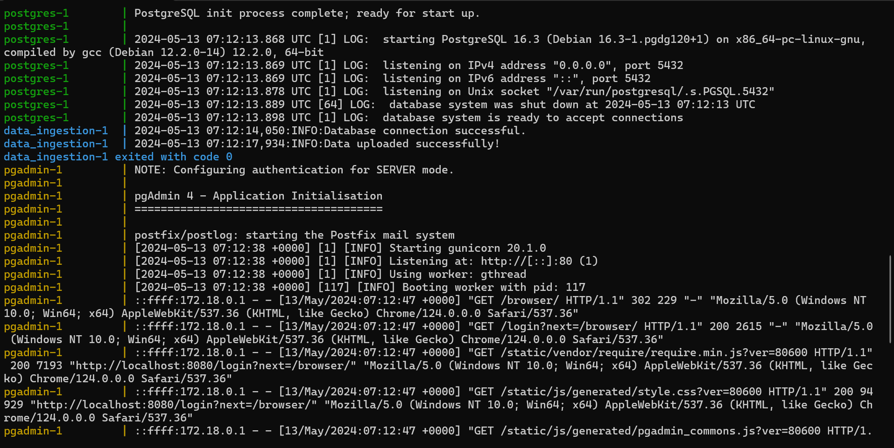
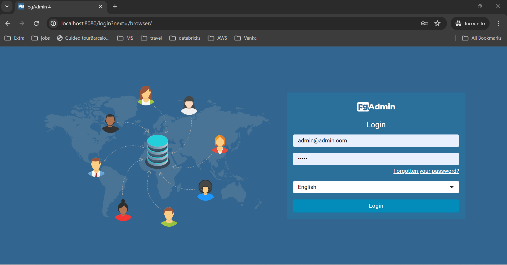
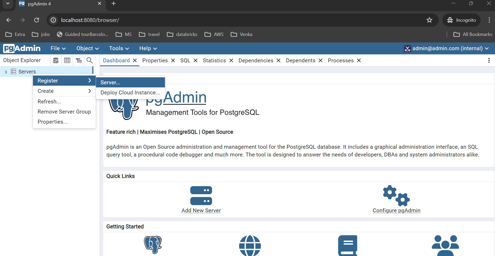
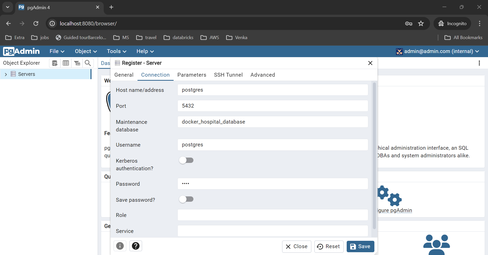
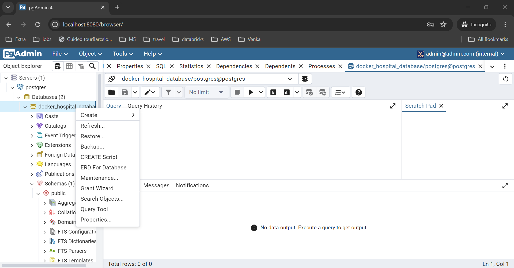
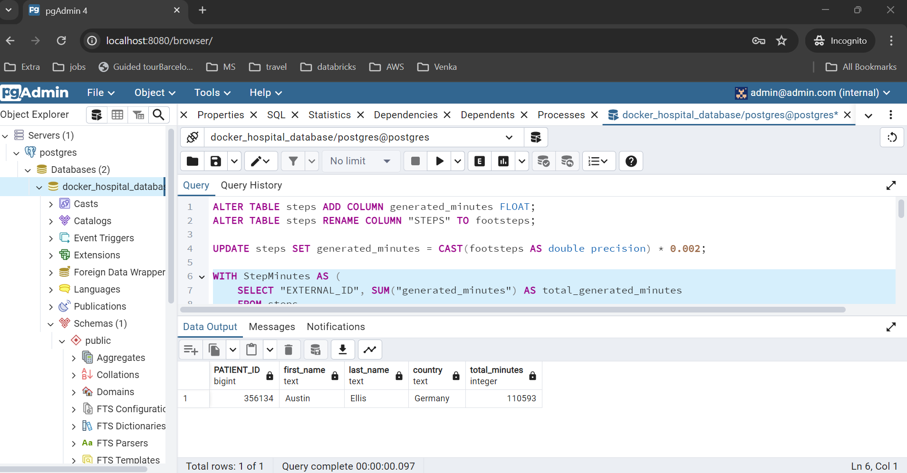
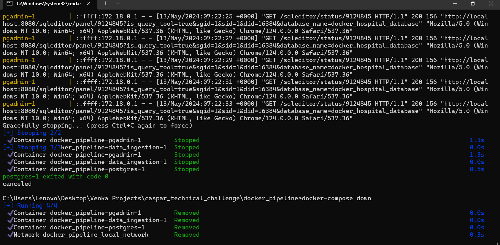

# ELT Pipeline using docker
This is an ELT pipeline build using Python, Git, Docker and Postgres DB. CSV files present under 
data folder gets read and written to postgres database using python and docker. We can query the tables using pgadmin 
or through http://localhost:8080. 
    
    
Prerequisites
    1. Docker (https://www.docker.com/products/docker-desktop/) and git should be installed in host machine.

## Step1: 
    a. run or start the docker desktop.
    b. Clone repository : https://github.com/venkateshhs/caspar_technical_challenge.git
    c. Move to directory docker_pipeline using command: cd docker_pipeline in CLI.
    d. run command: docker-compose up --build as shown in figure in CLI.

## Step2:
    Database gets created and csv's are written into respective table as shown in figure.

## Step3:
    a. Open any browser and run : http://localhost:8080 as shown in figure.
    b. Input admin@admin.com and admin as username and password -> press Login

## Step4:
    a. pgadmin gets loaded.
    b. right click on Server -> Register -> Server
    c. Register server dialog gets opened.

## Step5:
    a. Go to Connection tab.
    b. Input :
        Host name / Address: postgres
        Port: 5432
        Maintainance databse : docker_hospital_databse
        Username: postgres
        Password: root
    c. Click save.

## Step6: 
    a. pgadmin gets opened.
    b. Click Server -> postgres -> Database -> docker_hospital_database
    c. Right click on docker_hospital_database and select Query Tool.
    d. Copy and Paste query from query.sql

## Step7:
    a. Run each query one by one (By selecting the entire query) using Windows+F5 key.
    b. Results gets displayed.

## Step8:
    a. Go to CLI where docker commands are running. Press CTRL+C.
    b. Run command: Docker-compose down.

    
    
